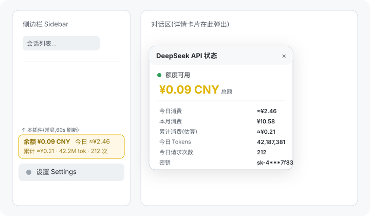

# deepseek-api-status

一个 [DeepSeek Harness](https://github.com/deepseek-ai/deepseek-harness) (DSH) **Web 界面**插件:在侧边栏"**设置**"按钮正上方**常显** DeepSeek API 余额条,点击展开完整面板——余额、累计消费、当日消费、Tokens、API 请求次数,每分钟自动刷新。

A [DeepSeek Harness](https://github.com/deepseek-ai/deepseek-harness) (DSH) **web GUI** plugin: an always-visible balance strip directly **above the Settings button** in the sidebar, expanding into a full panel — balance, cumulative spend, today's spend, tokens, and API request counts, auto-refreshing every minute.



## Features / 功能

- 侧边栏"设置"上方**常显余额条**(无需点击即可看到):`余额 ¥X.XX · 近30天 ¥X.XX`,每分钟自动刷新;
- 点击展开**参考风格用量卡片**(深色、260px 紧凑布局):头部密钥胶囊、**时间维度切换**(今日 / 本月 / 近30天)+ API Key 胶囊、**充值余额 / 累计消费**两栏、**消费金额 / API 请求 / Tokens** 三栏、**近 7 天消费迷你柱状图**;
- **低余额告警**(默认阈值 ¥10,数字变黄);
- 数据来源透明:余额为官方实时接口;累计消费为余额差值估算(持久化、充值自动校正、显示"≈");消费/请求/Tokens 为**官方平台用量接口**(与平台控制台一致);
- 深色主题风格(参考设计);
- API Key 不出本机:浏览器只访问本地路由,密钥在服务端按需解析。

## Install / 安装入口

需要 DSH CLI 与 [pnpm](https://pnpm.io/installation)。

```sh
# 方式一:从 GitHub 安装(推荐)
dsh plugin --profile web add github:qianTouchFish/dsh-deepseek-balance

# 方式二:完整 git URL
dsh plugin --profile web add git+https://github.com/qianTouchFish/dsh-deepseek-balance.git

# 方式三:本地目录(开发调试)
cd deepseek-api-status && dsh plugin --profile web add .
```

包声明了 `dsh.bundle`,`dsh plugin` 会自动把它加入 profile 的 bundle 层。然后:

1. 重启 Web 应用(桌面图标 / `dsh web`),刷新页面;
2. 侧边栏底部、**设置按钮上方**即出现余额条。

> 手动安装(不用 `dsh plugin`):把包放进 profile 的 `node_modules`,并在 `~/.dsh/profiles/web/cordis.patch.yml` 追加:
>
> ```yaml
> - insert:
>     - id: deepseek-api-status
>       name: deepseek-api-status
> ```

## Configuration / 配置

插件通过 harness 的凭据服务读取两个引用:

| 凭据 | 必需 | 作用 |
|---|---|---|
| `DEEPSEEK_API_KEY` | ✅ 必需 | 余额实时查询(与 harness 模型同源;可在 **设置 → 模型** 页面填写,存于 `~/.dsh/.credentials.yaml`) |
| `DEEPSEEK_PLATFORM_TOKEN` | ⭕ 可选 | 解锁官方 **Tokens / 请求次数 / 官方消费**(否则显示"估算"与 "—") |

### 获取 DEEPSEEK_PLATFORM_TOKEN

DeepSeek API 不公开用量查询接口;官方数据来自平台控制台所用会话令牌:

1. 浏览器登录 https://platform.deepseek.com;
2. F12 → Console 执行:
   ```js
   JSON.parse(localStorage.getItem('userToken')).value
   ```
3. 把输出追加到 `~/.dsh/.credentials.yaml`:
   ```yaml
   DEEPSEEK_PLATFORM_TOKEN: <那串令牌>
   ```
4. 重启服务即可(凭据服务会自动热加载,无需重启即可识别,但插件生效需重启)。

## Data sources / 数据来源

| 数据 | 来源 | 说明 |
|---|---|---|
| 余额 / 可用状态 | `api.deepseek.com/user/balance` | 官方实时 |
| 今日 / 累计消费 | 余额差值**估算** | 服务端持久化跟踪(`$DSH_HOME/storages/deepseek-api-status.json`),充值自动校正,显示 `≈` |
| Tokens / 请求次数 / 官方消费 | `platform.deepseek.com/api/v0/usage/amount` + `/usage/cost` | 官方平台数据(与控制台一致),需 `DEEPSEEK_PLATFORM_TOKEN` |

## How it works / 工作原理

| 部分 | 文件 | 作用 |
|---|---|---|
| 宿主侧 | `lib/index.js` | Cordis 插件(`inject: credentials, webServer`),注册 `GET /api/deepseek-status` |
| 状态采集 | `lib/status.js` | 余额拉取 + 差值跟踪(累计/今日估算) + 密钥掩码 |
| 平台用量 | `lib/platform.js` | 官方 usage/amount + usage/cost 解析(tokens / 请求次数 / 费用) |
| 浏览器侧 | `lib/client.js` | `dsh.client` web bundle:注册 `sidebar.footer.action` 余额条(设置上方)+ 自绘详情卡片,60 秒轮询 |
| 组合层 | `cordis.patch.yml` | `dsh.bundle` 补丁,插入加载项 |

## Development / 开发

```sh
# 本地安装(link 到源码目录,改完重启即生效,无需重装)
dsh plugin --profile web add .

# 冒烟测试(无需 harness)
node test-status.mjs   # 服务端逻辑(真实 key / 平台解析 / 差值跟踪)
node test-client.cjs   # 客户端 bundle 加载与注册
```

修改 `lib/client.js` 后需重启 `dsh web` 并强制刷新页面。

## Uninstall / 卸载

```sh
dsh plugin --profile web remove deepseek-api-status
```

## License

[MIT](LICENSE)
