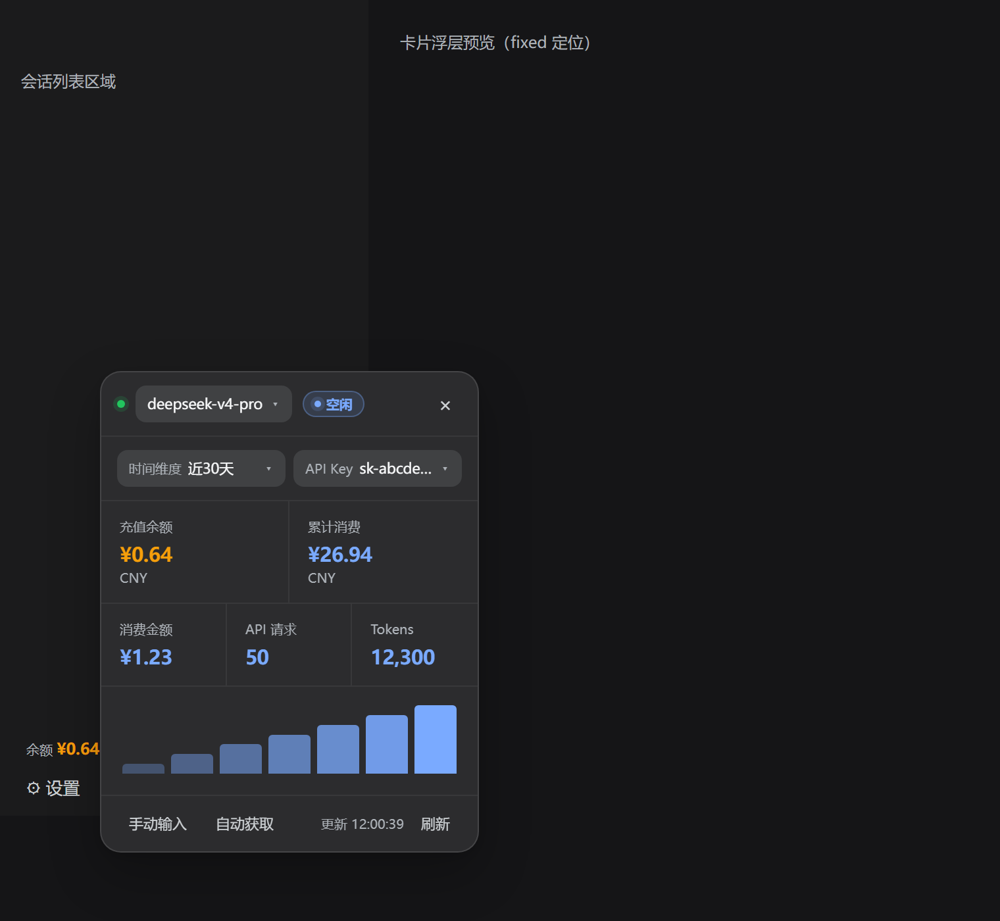
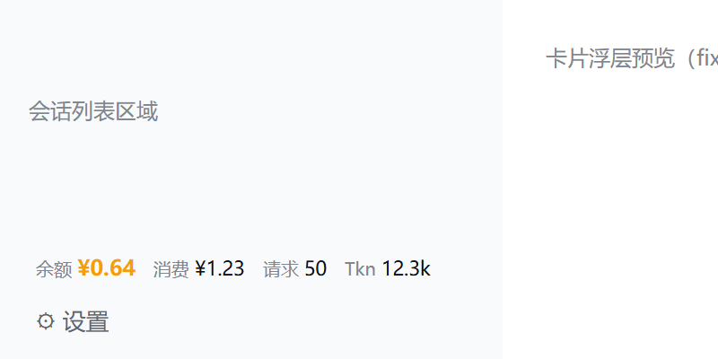

# dsh-deepseek-balance

[](LICENSE)
[](https://github.com/qianTouchFish/dsh-deepseek-balance/releases)

**DeepSeek Harness 的 DeepSeek 用量面板**:侧边栏"设置"上方**常显**用量条,点开是完整卡片——余额 / 消费 / 请求 / Tokens、按模型与时间维度统计、官方累计消费、高峰·空闲计费时段、平台令牌一键获取。界面完全基于 DSH 主题令牌渲染,自动跟随浅色 / 深色。

A DeepSeek usage panel for [DeepSeek Harness](https://github.com/deepseek-ai/deepseek-harness) (DSH): an always-visible strip above Settings plus a detail card with balance, spend, requests and tokens, per-model / per-period breakdowns, official cumulative spend and the live peak·off-peak pricing window. Rendered entirely from DSH theme tokens, so it follows light and dark automatically.



## 功能特性

- **常显用量条**:侧边栏"设置"上方显示 余额 / 消费 / 请求 / Tokens,每分钟自动刷新,低余额变琥珀色;
- **用量卡片**:按模型、按时间维度(今天 / 昨天 / 近7天 / 近30天 / 本月 / 上月)查看消费,含近 7 天迷你柱图;
- **官方累计消费**:取自 DeepSeek 平台控制台数据(未配置平台令牌时回退为余额差值估算,显示 `≈`);
- **高峰 / 空闲时段**:实时显示当前计费时段——北京时间 09:00–12:00、14:00–18:00 为高峰,其余为空闲;
- **令牌一键获取**:卡片内【自动获取】从本机 Chrome / Edge / Chromium 读取平台令牌(Windows / macOS / Linux);
- **主题自适应**:全部使用 DSH 设计令牌,跟随浅色 / 深色与自定义主题,不硬编码颜色;
- **选择持久化**:时间维度 / API Key / 模型选择保存在 localStorage;
- **网络容错**:余额请求遇瞬时握手失败自动重试,并在错误里显示真实原因。



## 安装前提

- **DeepSeek Harness** 已安装(桌面端 App 或 Web 端均可);
- **DeepSeek API Key**(`DEEPSEEK_API_KEY`,必需):余额查询用,在「设置 → 模型」页面填写;
- **平台令牌**(`DEEPSEEK_PLATFORM_TOKEN`,可选):解锁官方 Tokens / 请求次数 / 按模型分类 / 官方累计消费,可在卡片内一键获取;
- **自动获取令牌**:需本机已登录 https://platform.deepseek.com 的 **Chrome / Edge / Chromium**(不支持隐身模式)。

## 安装

`<包>` 可以是 GitHub 源、npm 包名或本地目录:

| 写法 | 示例 |
|---|---|
| GitHub 源 | `github:qianTouchFish/dsh-deepseek-balance` |
| 本地目录(开发调试) | `link:D:/Software/Deepseek/plugins/dsh-deepseek-balance` |

**桌面端 App**(用它自带的 CLI,路径以实际安装目录为准):

```sh
"<DeepSeek Harness 安装目录>/resources/runtime/cli/bin/dsh.cmd" plugin --profile desktop add <包>
```

**Web 端**(需要 DSH CLI 与 [pnpm](https://pnpm.io/installation)):

```sh
dsh plugin --profile web add <包>
```

安装后**重启应用并刷新页面**,侧边栏底部、设置按钮上方即出现用量条。

## 使用

1. 若余额一直显示 `—`,先到「设置 → 模型」填写 `DEEPSEEK_API_KEY`;
2. 打开用量卡片,点底部【自动获取】提取平台令牌(凭据热加载,无需重启应用);
3. 卡片内可切换**模型**、**时间维度**、**API Key**;点击任意空白处关闭下拉。

### 常见问题

**① 点【自动获取】提示"未找到 userToken"**

依次检查:本机有 Chrome / Edge / Chromium 且**已登录** platform.deepseek.com;未使用**隐身 / 无痕模式**;登录用的是默认配置(`Default` 或 `Profile N`)。仍失败可手动获取:平台页面 `F12` → Console 执行

```js
JSON.parse(localStorage.getItem('userToken')).value
```

把输出写入 `~/.dsh/.credentials.yaml`:

```yaml
DEEPSEEK_PLATFORM_TOKEN: <那串令牌>
```

**② 卡片显示"获取失败: fetch failed (SELF_SIGNED_CERT_IN_CHAIN)"**

杀毒软件的"加密连接扫描"(如卡巴斯基)会解密 HTTPS 并出示自己的证书,而 Node 不读取 Windows 证书库,于是间歇性拒绝连接。解决办法(任选其一):

- 在杀软的加密连接扫描里为 `api.deepseek.com`、`platform.deepseek.com` 添加**排除项**(推荐,一劳永逸);
- 让 Node 信任系统证书库(如启动参数 `--use-system-ca`,或设置 `NODE_EXTRA_CA_CERTS` 指向杀软根证书)。

插件已对这类瞬时失败自动重试,偶发失败通常下一次刷新即恢复。

## 数据来源

| 数据 | 来源 |
|---|---|
| 余额 / 可用状态 / 充值余额 | `api.deepseek.com/user/balance` |
| 累计消费 | `platform.deepseek.com/api/v0/users/get_user_summary` |
| 分时段 / 分模型消费、Tokens、请求数 | `platform.deepseek.com/api/v0/usage/amount` + `/usage/cost` |
| 高峰 / 空闲时段 | DeepSeek 官方峰谷计费规则(北京时间,客户端本地判定) |

API Key 与令牌只在本机使用:浏览器仅访问本地路由,凭据在服务端按需解析。

## 开发

```sh
npm test              # 服务端 + 客户端冒烟测试(无需 harness)
npm run test:render   # UI 渲染回归测试(需先 npm install 安装 devDependencies)
```

目录结构:

```
lib/     宿主与浏览器逻辑(index 入口 / status 采集 / platform 平台接口 / token 提取 / client 界面)
test/    冒烟与渲染回归测试
docs/    说明文档与界面预览图
```

## License

[MIT](LICENSE)
